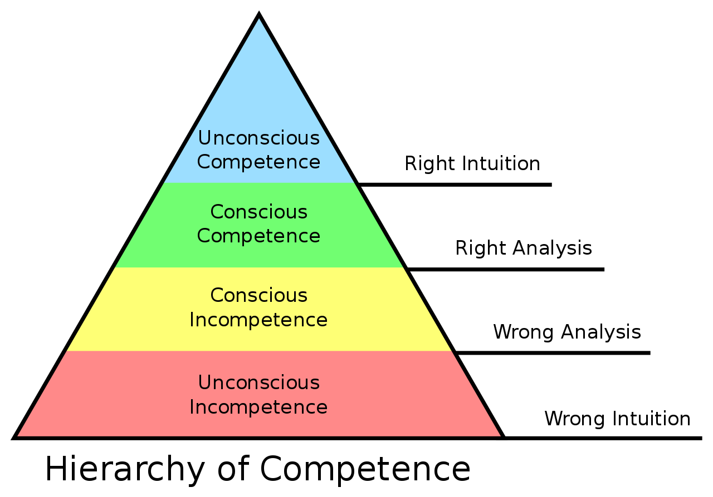

- https://en.wikipedia.org/wiki/Four_stages_of_competence
	- 
- **Unconscious incompetence**
	- The individual does not understand or know how to do something and does not necessarily recognize the deficit. They may deny the usefulness of the skill. The individual must recognize their own incompetence, and the value of the new skill, before moving on to the next stage. The length of time an individual spends in this stage depends on the strength of the stimulus to learn.
- **Conscious incompetence**
	- Though the individual does not understand or know how to do something, they recognize the deficit, as well as the value of a new skill in addressing the deficit. The making of mistakes can be integral to the learning process at this stage.
- **Conscious competence**
	- The individual understands or knows how to do something. It may be broken down into steps, and there is heavy conscious involvement in executing the new skill. However, demonstrating the skill or knowledge requires concentration, and if it is broken, they lapse into incompetence.
- **Unconscious competence**
	- The individual has had so much practice with a skill that it has become "second nature" and can be performed easily. As a result, the skill can be performed while executing another task. The individual may be able to teach it to others, depending upon how and when it was learned.