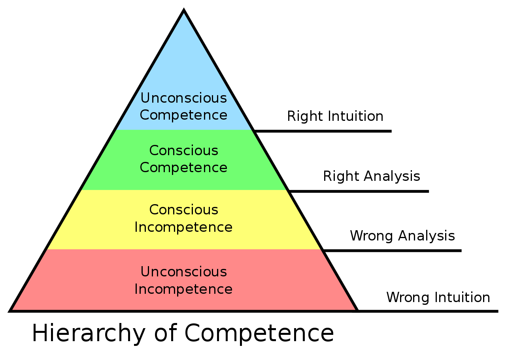

- https://cityteacher.wordpress.com/2007/06/10/the-four-stages-of-teaching/ (Kevin Ryan, *The Induction of New Teachers*)
	- **Fantasy**
		- Some people call this the idealistic stage. This is usually the period before a new teacher walks into the classroom. **The new teacher feels that she/he would make a fantastic teacher because of various reasons**, that the new teacher is there to save the world or at least save the children, and that every school day will be fun, fun, fun! The new teacher might voice the idea that, “Certainly, teaching will be hard.” Inwardly, the teacher knows that it would be easy.
	- **Survival**
		- This usually begins sometime during the middle of the first day of teaching. I kid you not. The Fantasy Stage meets the reality of real personalities in the form of 20-40 children all with their own wants, needs, and demands. The Survival teachers begin to rely on practices that they see other teachers use, some effective, most ineffective, to get through the day. Teaching becomes a matter of getting through one day after another and holding on till paycheck day. Many Survival teachers begin to **whine and make excuses, give busywork, and take no responsibility for the students’ learning**. They make fun of professional development meetings and never actually develop as a professional. Their conversations in the lunch room begins with “These kids …” in a high, whiny voice. Because the Survival teachers do not succeed in teaching their students, they will try to convince the teachers around them that it’s not possible and make fun of teachers who are working hard. Unfortunately, **many teachers never leave this stage.**
	- **Mastery**
		- The Mastery Stage begins when teachers **take responsibility** for what goes on in their classroom and **hold themselves accountable** for their students’ learning. Suddenly, the Master teacher **uses effective practices**, have high expectations, and strive to improve professionally at all times. The Master teacher is not afraid to ask for help or “How did you do that?” This is where true enjoyment of teaching begins. The Master teacher is very threatening to the Survival teachers because they are living proof that “these kids” can learn, therefore all the Survival teacher’s excuses are a sham. The Master teacher may not yet be the model teacher, but their attitude and professionalism will soon lead them there.
	- **Impact**
		- This is the ultimate teacher, the award winning teacher who makes an impact on his/her students’ lives. Every day is focused on learning effectively, rigorously, and in an engaging manner. The students may view this as fun, fun, fun and in a real sense, the Impact teacher has achieved the dreams of the Fantasy teacher. The teacher has come full circle and teaching is an everyday joy.
	-
	- Now, I view these stages as a spectrum or even that full circle. I am somewhere in the Mastery stage and working on heading toward the Impact stage. **My Survival stage lasted about three years** and on the third year, I almost succumbed to the negative views of my fellow teachers. Thank goodness I somehow got out of it, perhaps because I saw that I was having a positive effect on this one particular child.
-
-
-
- ## 4 Stages of Competence
- https://en.wikipedia.org/wiki/Four_stages_of_competence
	- 
- **Unconscious incompetence**
	- The individual does not understand or know how to do something and does not necessarily recognize the deficit. They may deny the usefulness of the skill. The individual must recognize their own incompetence, and the value of the new skill, before moving on to the next stage. The length of time an individual spends in this stage depends on the strength of the stimulus to learn.
- **Conscious incompetence**
	- Though the individual does not understand or know how to do something, they recognize the deficit, as well as the value of a new skill in addressing the deficit. The making of mistakes can be integral to the learning process at this stage.
- **Conscious competence**
	- The individual understands or knows how to do something. It may be broken down into steps, and there is heavy conscious involvement in executing the new skill. However, demonstrating the skill or knowledge requires concentration, and if it is broken, they lapse into incompetence.
- **Unconscious competence**
	- The individual has had so much practice with a skill that it has become "second nature" and can be performed easily. As a result, the skill can be performed while executing another task. The individual may be able to teach it to others, depending upon how and when it was learned.