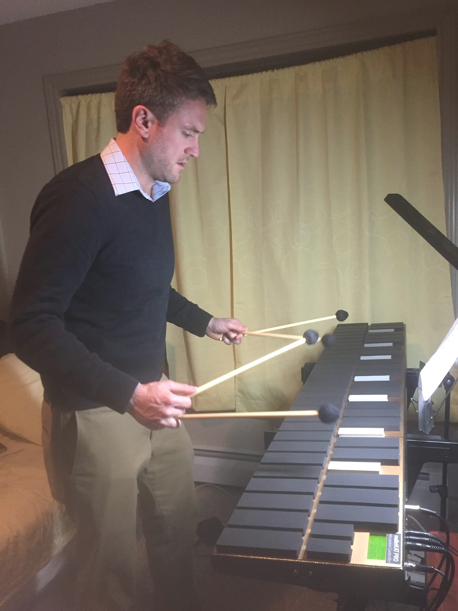

- I founded [Hyperfiddle](https://www.hyperfiddle.net/) and created [Electric Clojure](https://github.com/hyperfiddle/electric).
- I'm an independent software researcher with 20 years experience in commercial UI development across all platforms from web to VR. [[Tech talk history]].
- My research interest is in in the fine-grained computational structure of user interfaces and how that understanding maps upwards to application, system, enterprise and even web-scale structures.
- In the evenings I practice vibraphone and read math textbooks, currently [Atoms, Molecules and Optical Physics](https://www.amazon.com/dp/3642543219).
	- {:height 358, :width 257}
	-
- [Twitter](https://twitter.com/dustingetz) · [Linkedin](https://www.linkedin.com/in/dustingetz/) · [Github](https://github.com/dustingetz)
- Contact: DM me anywhere
-
-
-
- ## Aphorisms for Founders and Product Managers
  id:: 66c0d597-0b75-4bb5-9237-6f61370d8922
	- Assumptions are what gets you killed
	- Opportunity is the space between your competitors' assumptions
	- Intuition is the antonym of reason
	- What we wish, that we readily believe. — Demosthenes
	- Engineering is done with numbers. Analysis without numbers is just an opinion
	- Man errs because his will affirms or negates ideas that are not clear or distinct — Descartes
	- Again, define your terms, or we shall never understand one another — Voltaire
	- Language shapes the way we think, and clarity of thought is measured through clarity of language.
	- [[The Curse of Development: the depth of any transaction is limited by the depth of the shallower party]] — Venkatesh Rao
	- Being understood is too big an ask because it requires controlling the other person's perspective. Try instead to communicate
	- Communication usually fails, except by accident
	- [[You Can't Tell People Anything (you have to show them)]] — Chip Morningstar
	- Marketing is telling someone something that they already believe to be true
	- Working with existing ideas is often mired in existing biases, sunk cost fallacies, and a shroud of confidentiality — all of which limit teams from taking off their blinders and really see the world of possibility.
	- Judgments are projections of the judge
	- Everyone has an angle
	- Groups never admit failure, you get a schism instead
	- You do not rise to the level of your goals. You fall to the level of your systems.
	- The goal is not to avoid mistakes; the goal is to achieve uncorrelated levels of excellence in some dimension — Nat Friedman
	- [[You can’t find secrets without looking for them]] — Peter Theil
	- [[Much madness is divinest sense]] — Emily Dickinson
	- [[You can sometimes do what sounds impossible by reframing your problem]] — John D. Cook
	- Impossible is just a big word thrown around by small men who find it easier to live in the world they’ve been given than to explore the power they have to change it. — Muhammad Ali
	- If a system is to serve the creative spirit, it must be entirely comprehensible to a single individual. Human potential manifests in individuals. — Dan Ingalls
	- Civilization advances by extending the number of operations we can perform without thinking about them
	- Time is the denominator
	- Energy, not time, is our most precious resource. —Jim Loehr
	- [[Sufficiently Powerful Optimization Of Any Known Target Destroys All Value]] — Scott Alexander
-
-
- ## How to start a startup (and succeed)
	- [[Aphorisms for Product Management]]
	- [[Model: Previously Unknown Axiom]]
	- [[Model: Cynefin, a map of uncertainty]]
	- [[The CAC Problem]]
	- [[DevOps Maturity Levels]]
	- [[Apex strategy framework for startup work alignment]]
	- [[Positioning statement]]
	- [[Minimum Viable Plan = Risk Mitigation + Goal Invalidation]]
	- [[You Can't Tell People Anything (you have to show them)]]
	- [[List of developer tool GTM motions]]
	- [[Coordinating solutions to inadequate eqilibriums]]
	- [[Sufficiently Powerful Optimization Of Any Known Target Destroys All Value]]
	- [[4 Stages of Teaching]]
	- [[If we can’t test it, is it science?]]
	- [[On Big Startup Ideas (2017)]]
	- [[Coordinating solutions to inadequate eqilibriums]]
-
- public:: true