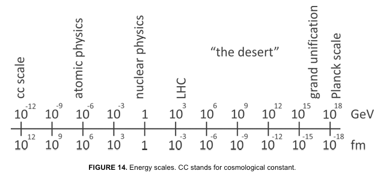

public:: true

- Below is a quick selection of quotes from **Lost in Math: How Beauty Leads Physics Astray** by Sabine Hossenfelder ([Goodreads](https://www.goodreads.com/en/book/show/36341728), [Amazon](https://www.amazon.com/Lost-Math-Beauty-Physics-Astray/dp/0465094252)).
- What an impressive and impeccably sourced book, and manages to be an easy read while still going quite deep, it was my bedtime reading for a month.
- **Theme:** Physics, in its search for grand unification, has made a number of elegant predictions with stunning mathematic symmetry that have simply not come true once becoming testable as the particle accelerator energies catch up. "If we can’t test it, is it science?"
- I think she is addressing her colleague physicists?
-
- In lieu of a summary, here is a selection of 10 quotes that make up the spine of the narrative so you can judge for yourself:
-
- Math keeps us honest
	- "In physics, theories are made of math. We don’t use math because we want to scare away those not familiar with differential geometry and graded Lie algebras; we use it because we are fools. Math keeps us honest—it prevents us from lying to ourselves and to each other. You can be wrong with math, but you can’t lie. Our task as theoretical physicists is to develop the mathematics to either describe existing observations, or to make predictions that guide experimental strategies. Using mathematics in theory development enforces logical rigor and internal consistency; it ensures that theories are unambiguous and conclusions are reproducible."
- Symmetry as an organizing principle
	- FOR THE physicist, a symmetry is an organizing principle that avoids unnecessary repetition. Any type of pattern, likeness, or order can be mathematically captured as an expression of symmetry. The presence of a symmetry always reveals a redundancy and allows simplification. Hence, symmetries explain more with less.
- Simplicity, naturalness, and elegance
	- THE MODERN faith in beauty’s guidance is, therefore, built on its use in the development of the standard model and general relativity; it is commonly rationalized as an experience value: they noticed it works, and it seems only prudent to continue using it. Gell-Mann himself relates that **“in fundamental physics a beautiful or elegant theory is more likely to be right than a theory that is inelegant.”** Lederman, the young man who asked Fermi about the K-zero-two, went on to win a Nobel Prize as well, and he too became a beauty convert: “We believe that nature is best described in equations that are as simple, beautiful, compact and universal as possible.” Steven Weinberg, who was awarded a Nobel Prize for unifying the electromagnetic and weak interaction, likes to make an analogy with horse breeding: “[The horse breeder] looks at a horse and says ‘That’s a beautiful horse.’  While he or she may be expressing a purely aesthetic emotion, I think there’s more to it than that. The horse breeder has seen lots of horses, and from experience with horses knows that that’s the kind of horse that wins races.”
- Seduced by beauty
	- For example, a widely used textbook on string theory, written by Lars Brink and Marc Henneaux, begins this way: **“The almost irresistible beauty of string theory has seduced many theoretical physicists in recent years. Even hardened men have been swept away** by what they can already see and by the promise of even more.” And John Schwarz, one of the founders of the field, recalls: “The mathematical structure of string theory was so beautiful and had so many miraculous properties that it had to be pointing toward something deep.”
- Limits of experiments
	- The resolution that can be achieved with accelerators is inversely proportional to the total energy of the colliding particles. A good benchmark to remember is that an energy of 1 GeV (that’s 109 eV or 10−3 TeV, about the mass of the proton) corresponds to a resolved distance of approximately **1 femtometer (10−15 m, about the size of a proton)**. An order up in energy means an order down in distance and vice versa. The LHC was designed to reach a peak collision energy of about 10 TeV. This corresponds to about 10−19 m and is the shortest distance at which we have tested the laws of nature—so far.
		- 
			- *Note: distance is femto scale; 1 fm ~ proton size*
	- THE PLANCK energy is where we should start to notice the quantum fluctuations of space-time. **It’s at approximately 10^18 GeV, gigantically large compared to the energies that we can reach with colliders (see Figure 14).** The large gap between the presently accessible energies and the energies at which grand unification and quantum gravity should become relevant is often called “the desert” because, for all we know right now, it might be void of new phenomena. **If we wanted to directly reach Planckian energies, we’d need a particle collider about the size of the Milky Way.** Or if we wanted to measure a quantum of the gravitational field—a graviton—the detector would have to be the size of Jupiter and located not just anywhere but in orbit around a potent source of gravitons, such as a neutron star. Clearly these aren’t experiments we’ll get funded anytime soon. Hence many physicists are pessimistic about the prospects of testing quantum gravity, which leads to a philosophical conundrum: **if we can’t test it, is it science?**
- Theories that don't need to be tested?
	- “What are you worried about?” I begin. “There are physicists now saying we don’t have to test their ideas because they are such good ideas,” George says. He leans forward across the table and stares at me. “They’re saying—explicitly or implicitly—that they want to weaken the requirement that theories have to be tested.” He pauses and leans back, as if to make sure I understand the gravity of the situation. “To my mind that’s a step backwards by a thousand years,”
- The Diphoton Anomaly
	- Dec 15, 2015: Olsen reveals a new deviation from the standard model: too many events of a decay, which leaves behind two photons. Dubbed the “diphoton anomaly,” this excess doesn’t fit any of the existing predictions. It’s incompatible with the standard model. It’s incompatible with all theories we know. ... Kado’s summary is almost identical to Olsen’s. ATLAS too has seen a diphoton excess where there shouldn’t be one. That both experiments independently saw it substantially decreases the risk that the signal is mere coincidence. Taken together, they arrive at **a chance of 3 in 10,000 that the excess is a random fluctuation**. That’s still far off the standard of certainty that particle physicists require for a discovery, which is roughly 1 in 3.5 million. But this could be it, I think, the first step on the way to a more fundamental law of nature. Immediately we start discussing what it could be. A day later, the open-access server arXiv.org lists ten new papers on the diphoton anomaly.
	- June 22, 2016: The first rumors appear that the diphoton bump is fading away with the new LHC data.
	- July 21, 2016: The LUX dark matter experiment concludes its search and reports no signal of WIMPs.
	- July 29, 2016: The rumor that the diphoton anomaly is gone heats up.
	- August 4, 2016: The new LHC data are published. They confirm that the diphoton bump is gone for good.
	- **In the eight months since its “discovery,” more than five hundred papers were written about a statistical fluctuation.** Many of them were published in the field’s top journals. The most popular ones have already been cited more than three hundred times.
- Conflict of interest
	- Theoretical physicists are guilty of sweeping difficult questions under the rug and instead focusing on questions that are more likely to produce publishable results in a short period of time. The reason for the current lack of progress may be that we focus on the wrong questions.
	- You have to get over the idea that all science can be done by postdocs on two-year fellowships. Tenure was institutionalized for a reason, and that reason is still valid. If that means fewer people, then so be it. You can either produce loads of papers that nobody will care about ten years from now, or you can be the seed of ideas that will still be talked about in a thousand years. Take your pick. Short-term funding means short-term thinking.
- Cognitive bias
	- The in-group bias makes us think researchers in our own field are more intelligent than others. The shared information bias is why we keep discussing what everyone knows but fail to pay attention to information held only by a few people. We like to discover patterns in noise (apophenia). We think arguments are stronger if the conclusion seems plausible (belief bias). And the halo effect is the reason you are more interested in what a Nobel Prize winner says than what I say—regardless of the topic. There’s also the false consensus effect: we tend to overestimate how many other people agree with us and how much they do so. And one of the most problematic distortions in science is that we consider a fact to be more likely the more often we have heard of it; this is called attentional bias or the mere exposure effect. We pay more attention to information especially when it is repeated by others in our community. This communal reinforcement can turn scientific communities into echo chambers in which researchers repeat their arguments back to each other over and over again, constantly reassuring themselves they are doing the right thing. Then there is **the mother of all biases, the bias blind spot—the insistence that we certainly are not biased.** It’s the reason my colleagues only laugh when I tell them biases are a problem, and why they dismiss my “social arguments,” believing they are not relevant to scientific discourse. But the existence of these biases has been confirmed in countless studies. And there is **no indication whatsoever that intelligence protects against them;** research studies have found no links between cognitive ability and thinking biases.
- if we can’t test it, is it science?
	- BUILD A CULTURE OF CRITICISM. Ignoring bad ideas doesn’t make them go away; they will still eat up funding. Read other researchers’ work and make your criticism publicly available. Don’t chide colleagues for criticizing others or think of them as unproductive or aggressive. **Killing ideas is a necessary part of science. Think of it as community service.**
	- Does the scientists’ future funding depend on producing the results they just told you about? Does the scientists’ chance of continuing their research depends on their work being popular among their colleagues? Have the scientists have taken steps to address their cognitive biases? You will find that for almost all research in the foundations of physics the answer to at least one of these questions is no. This means you can’t trust these scientists’ conclusions. Sad but true.
	-