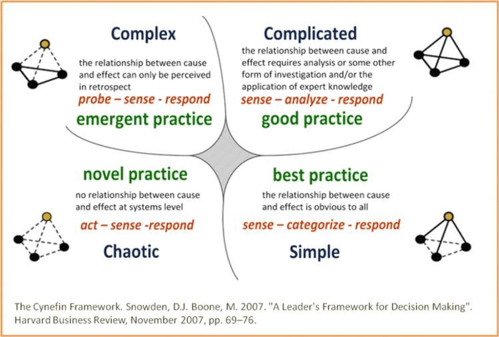
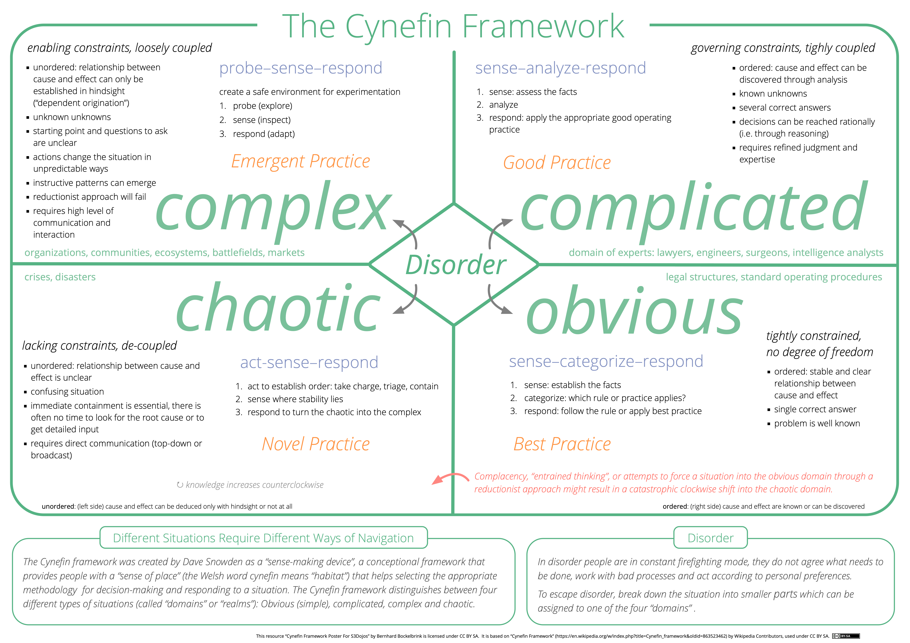

public:: true

- Cynefin (pronounced "kinevin") = a framework for dealing with (operating in) uncertainty
	- provides managers with the means to realize that they are facing a messy, intractable problem, and with the tools to enable them to make progress in this imperfect world.
	- we must recognize that traditional management approaches only work within certain boundaries, and that **if we are not in an ordered space, they do not apply**
- invented by Dave Snowden: https://twitter.com/snowded
-
- 
-
- Examples
	- Clear: The checklist of items that are not allowed in your hand luggage when boarding a plane
	- Complicated: The engineering process of building a bridge
	- Complex: A childrens' party
	- Chaos: Carnival is an example.
-
- At its simplest, Cynefin distinguishes **order** from **complexity** from **chaos**
	- these different systemic contexts exist in parallel, avoiding creating false dichotomies and polarization
- three kinds of systems
	- **Ordered systems** are governed and constrained in such a way that cause and effect relationships are either clear or discoverable through analysis;
	- **Complex systems** where causal relationships are entangled and dynamic and the only way to understand the system is to interact with it;
		- intervention in a complex system -> unintended consequences
			- use experiments to address this risk
	- **Chaotic systems** where there are no effective constraints (no structure), turbulence prevails and immediate stabilizing action is required.
- two kinds of order
	- **Clear** (where the relationship between cause and effect is self-evident and clear to any reasonable person and constraints are rigid or fixed)
	- **Complicated** (where, while the relationship between cause and effect exists, discovering it requires expertise or analysis and the constraints are governing, giving confidence in the boundary of expertise).
-
- Implications
	- "A fundamental tenet [of Cynefin] is that **there are few, if any, context-free solutions** but many valid context-specific ones"
-
-
- Sources
	- Video: [Complex Adaptive Systems - Dave Snowden - DDD Europe 2018](https://www.youtube.com/watch?v=l4-vpegxYPg) (start here)
	- Mini-book: [Cynefin Framework as a Guide to Agile Leadership (2020)](https://www.amazon.com/gp/product/3752647965/)
	- complex adaptive systems theory
	- https://cynefin.io/wiki/Anthro-complexity
	- https://cynefin.io/wiki/Cynefin_Domains
-
- {{twitter https://twitter.com/dustingetz/status/1674849366446571536}}
-
-
- Detail version, poster resolution
- 
-
- Quotes from the mini book:
	- an approach and a set of practices for addressing the uncertainty that increasingly management faces today. It provides managers with the means to realize that they are facing a messy, intractable problem, and with the tools to enable them to make progress in this imperfect world.
	- This is a significant change from the more traditional approaches, which try to reduce a problem to a set of rational actions and acknowledges that in some instances we cannot predict the outcome. Instead of obsessing about predicting the future, we can move to controlling the future, and therefore we don't need to predict everything.
	- The Cynefin framework can be used in different ways: for **categorization**, which is useful from a situational perspective; for **contextualization**, which is useful in establishing a checkpoint and deciding what we want to do; and from a **dynamics** perspective – we are *here* and we need to move to *there*, so this is the journey that we need to consider.
		- **categorization**: we are using the framework to understand which domain we are in, and therefore which approach (act/sense/respond etc.) is the most appropriate. This is useful to ensure that we don't oversimplify the situation and attempt to address an un-ordered problem using traditional ordered techniques. This is a singular situation, but the exemplar narrative outlined below can help to determine which domain we find ourselves in.
		- **contextualization**: there is a need to work out where we are, given all the issues that we are facing. We may need to consider where the company is going and the challenges facing a project or program that is in flight, or we may be looking at starting a new initiative. This is about making sense of the wider situation and, given all the challenges, working out what needs to be done, acknowledging that not everything is obvious.
		- A **dynamics** perspective addresses a need to move a part of an organi-sation or group of people in a certain direction. may involve removing or loosening the constraints to see if we can change behaviors or create novel ones. This is called "complex facilitated management"