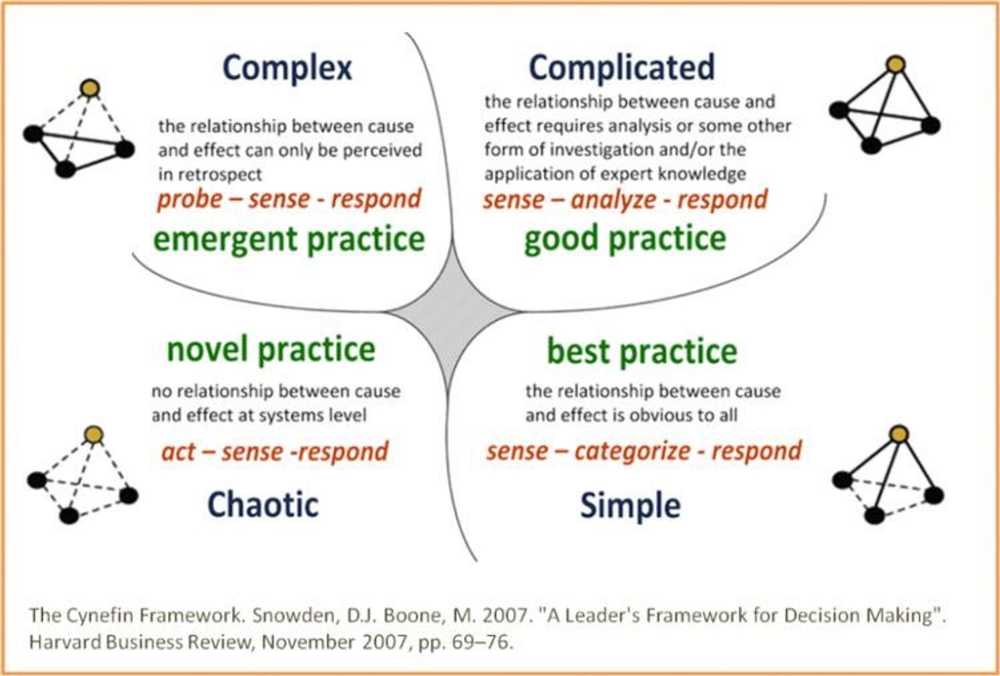
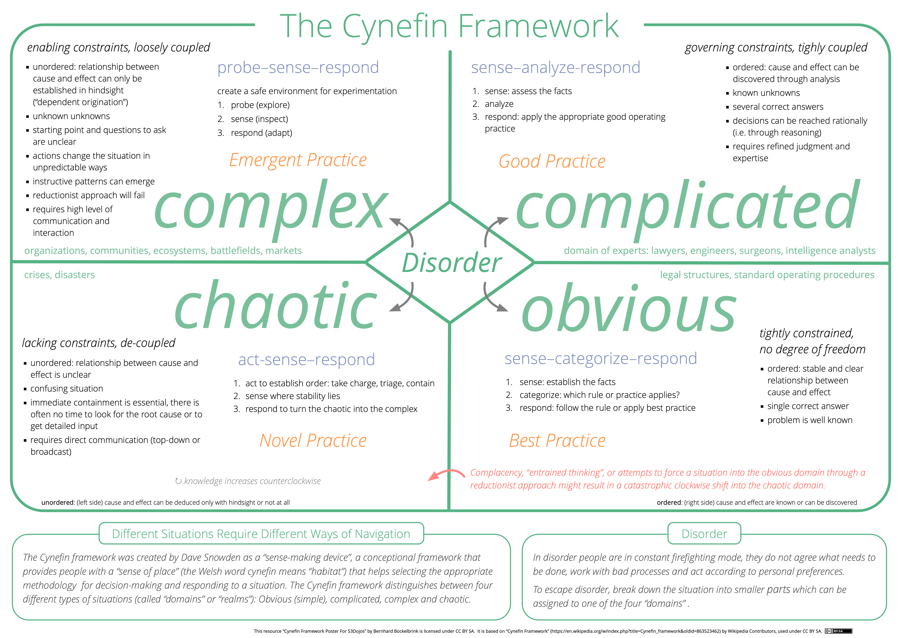

- Cynefin (pronounced "kinevin") = a framework for dealing with (operating in) uncertainty
	- provides managers with the means to realize that they are facing a messy, intractable problem, and with the tools to enable them to make progress in this imperfect world.
	- we must recognize that traditional management approaches only work within certain boundaries, and that **if we are not in an ordered space, they do not apply**
	- there are few, if any, context-free solutions but many valid context-specific ones
- invented by Dave Snowden: https://twitter.com/snowded
-
- 
-
- Examples
	- Clear: The checklist of items that are not allowed in your hand luggage when boarding a plane
	- Complicated: The engineering process of building a bridge
	- Complex: A childrens' party
	- Chaos: Carnival is an example.
-
- three kinds of systems
	- **Ordered systems** are governed and constrained in such a way that cause and effect relationships are either clear or discoverable through analysis;
	- **Complex systems** where causal relationships are entangled and dynamic and the only way to understand the system is to interact with it;
		- complex systems cannot be predicted in advance, only in retrospect can they be understood
		- intervention in a complex system -> unintended consequences
			- use experiments to address this risk
	- **Chaotic systems** where there are no effective constraints (no structure), turbulence prevails and immediate stabilizing action is required.
- the 3 systemic contexts exist in parallel, avoiding creating false dichotomies and polarization
-
- two kinds of order
	- **Clear** (where the relationship between cause and effect is self-evident and clear to any reasonable person and constraints are rigid or fixed)
	- **Complicated** (where, while the relationship between cause and effect exists, discovering it requires expertise or analysis and the constraints are governing, giving confidence in the boundary of expertise).
-
- Purpose
	- Instead of obsessively *forecasting* the future, move to *controlling* the future.
		- e.g. fake schedules
		- you don't need to predict everything, merely influence
-
- three ways to use the framework
	- **categorization** is useful from a situational perspective
		- we are using the framework to understand which domain we are in, and therefore which approach (act/sense/respond etc.) is the most appropriate. This is useful to ensure that we don't oversimplify the situation and attempt to address an un-ordered problem using traditional ordered techniques. This is a singular situation, but the exemplar narrative outlined below can help to determine which domain we find ourselves in.
	- **contextualization** is useful in establishing a checkpoint and deciding what we want to
		- there is a need to work out where we are, given all the issues that we are facing. We may need to consider where the company is going and the challenges facing a project or program that is in flight, or we may be looking at starting a new initiative. This is about making sense of the wider situation and, given all the challenges, working out what needs to be done, acknowledging that not everything is obvious.
	- **dynamics** – we are *here* and we need to move to *there*, so this is the journey that we need to consider
		- addresses a need to move a part of an organization or group of people in a certain direction. may involve removing or loosening the constraints to see if we can change behaviors or create novel ones. This is called "complex facilitated management"
-
- Sources
	- Video: [Complex Adaptive Systems - Dave Snowden - DDD Europe 2018](https://www.youtube.com/watch?v=l4-vpegxYPg) (start here)
	- Mini-book: [Cynefin Framework as a Guide to Agile Leadership (2020)](https://www.amazon.com/gp/product/3752647965/)
	- complex adaptive systems theory
	- https://cynefin.io/wiki/Anthro-complexity
	- https://cynefin.io/wiki/Cynefin_Domains
-
- {{twitter https://twitter.com/dustingetz/status/1674849366446571536}}
- {{twitter https://twitter.com/tom_d_kerwin/status/1676298479805558799}}
-
- Detail version, poster resolution
- {:height 559, :width 778}
-