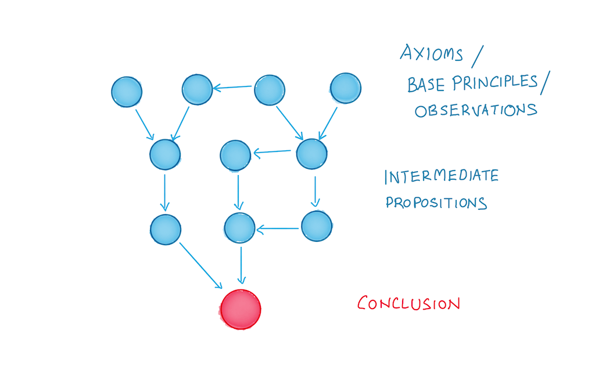
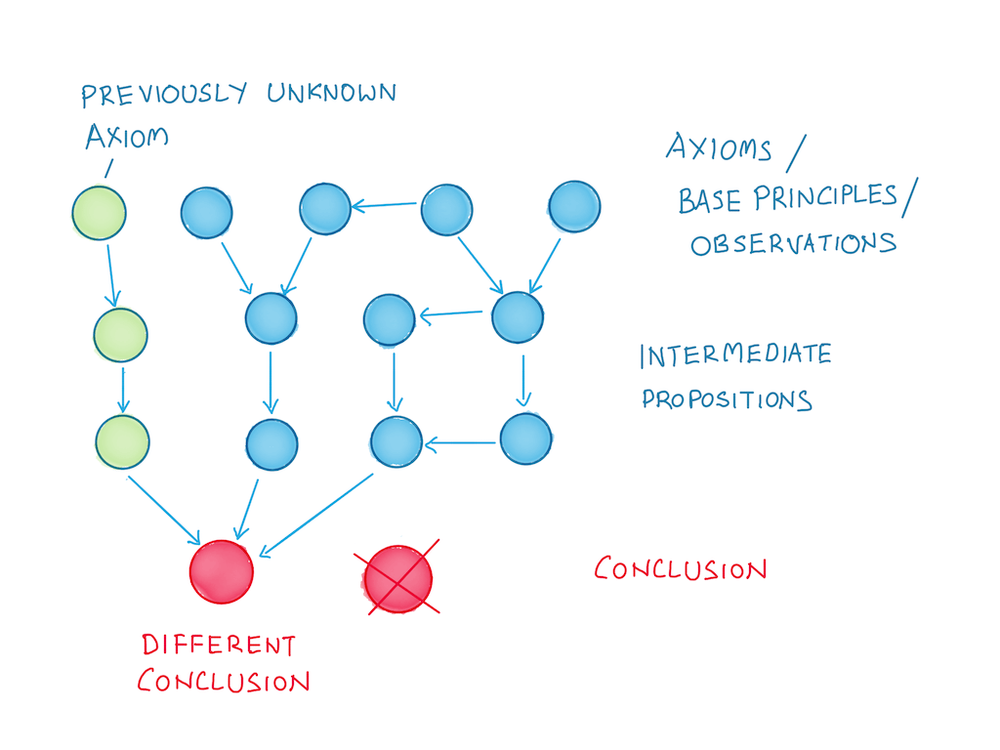

public:: true

- Source: https://commoncog.com/how-first-principles-thinking-fails/
- 
- 
- Blind spots are how really smart people fail
	- Blind spots = undetected assumption
		- "Assumptions are what gets you killed"
		- unknown unknowns
	- Blind spots -> over-confidence -> broken assumptions
	- **Smart person fallacy**
		- smart people get less feedback, you can only trust yourself
		- they've corrected for other forms of error, so when they do make the occasional mistake, it is of this category (blind spot)
		- Blind spots are insidious - they are impossible to detect
			- being smarter doesn't help
	- Expertise is local, nobody is expert at everything
- How to compensate
	- Feedback
		- high frequency
		- see control theory
		- unbiased third party observer
		- feedback is hard
			- real feedback requires trust
			- you must constantly seek it
			- you must reward it when you get it
				- Powerful phrase: **"Thank you for the feedback"**
	- Mapping
		- Mapping the territory lets you know where the possible blind spots are
			- **Know what is known**
			- Maps are exhaustive, they show you the entire space
		- Concept maps, e.g. science and math
		- Frameworks and mental models
	- Analysis (writing)
	- Listen carefully
-