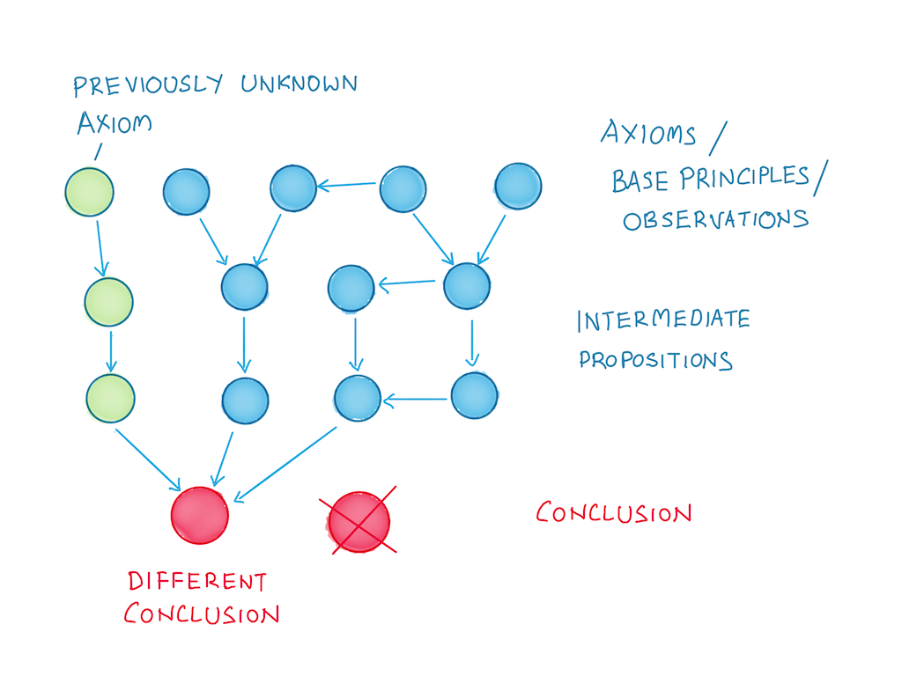

public:: true

- 
-
- Source: https://commoncog.com/how-first-principles-thinking-fails/
	- "But I think there's a more pernicious form of failure, which occurs when you reason from the **wrong set of true principles**. It is pernicious because you can’t easily detect the flaws in your reasoning. **It is pernicious because all of your base axioms are true.**
	- "If you pick the wrong set of base principles — even if they’re all true — you are likely to end up with the wrong conclusion at the end of your thinking. In other words, the only real test you have is against reality. Your conclusion should be useful. It should produce effective action.
	- "Conversely, it’s possible to ‘figure everything out’, only to learn a new piece of information that changes everything, that reconfigures all the reasoning chains in your argument."
-
-
-
- Blind spots are how smart people fail
	- Blind spots = undetected assumption
		- "Assumptions are what gets you killed"
		- unknown unknowns
	- Blind spots -> over-confidence -> broken assumptions -> killed
	- **Smart person fallacy**
		- smart people get less feedback, you can only trust yourself
		- they've corrected for other forms of error, so when they do make the occasional mistake, it is of this category (blind spot)
	- **Blind spots are insidious – they are impossible to detect** without external feedback
		- being smarter doesn't help
		- you need a different perspective to see into the blind spot
	- Expertise is local, nobody is expert at everything
- How to compensate
	- Feedback
		- high frequency
		- see control theory
		- unbiased third party observer
	- feedback is hard
		- real feedback requires trust
		- you must constantly seek it
		- you must reward it when you get it
			- Powerful phrase: **"Thank you for the feedback"**
		- Listen carefully
	- Mapping
		- Mapping the territory is how you identify where the possible blind spots are
			- Concept maps, e.g. science and math
			- **Know what is known**
		- Maps are exhaustive, they show you the entire space
		- obviously you need the right map (blind spot at meta level)
			- map the maps ...
		- Collect frameworks and mental models
			- your index of maps, i.e. meta map
	- Analysis (writing)
		- Do you really know? **Or do you just like seeing yourself as someone who knows things?**
			- Powerful phrase: "How do you know?"
		- Writing makes you accountable to yourself
			- How do I know? prove it to yourself
		- Writing as a synthesis activity
			- Compare to formal learning process (i.e. at university)
				- textbook -> lecture -> homework -> quiz -> lab -> midterm exam -> final exam
					- synthesis – if you don't do the homework you won't pass the test!
					- feedback – how do you know you know
		- Knowledge decay
-
- List of blind spots in famous smart people
	- Smart haskell programer who hates dynamic languages
		- Haskell twitter
	- Smart dynamic lang programmer who hates typed languages
		- Clojure twitter
		- Rich Hickey
	- Venture capitalist