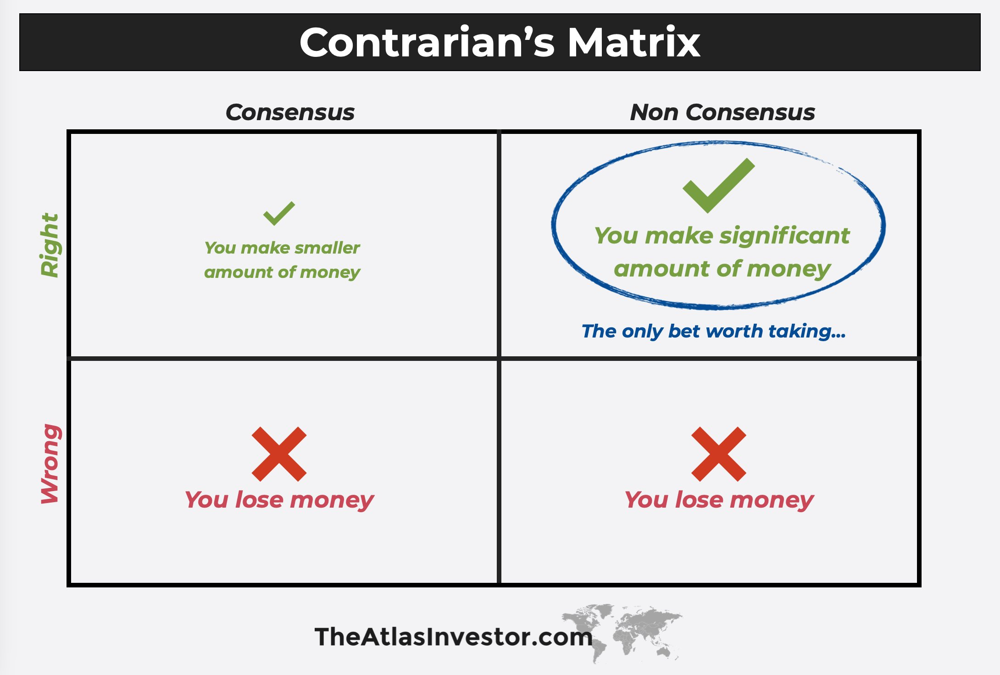

- The median VC loses money. Here are some reasons why!
- What am I missing? Send me your notes!
-
- 80/20 rule
	- returns are sharply concentrated in winners – power law distribution
	- Peter Theil invested $500k in Facebook and got 100,000x return
- too long time horizons
	- Funds take 7-10 years to distribution, in a bull market
	- In current bear market, IPOs have been paused, funds are getting extended to 15 year term
	- It takes 5 years to even validate a hypothesis (e.g. AI), but fund is deployed in 3 years, so entire funds are deployed into thematic hypotheses before results are clear (AI, Cryptocurrency, self-driving cars, VR)
	- delayed accountability leads to hubris - humans primarily seek validation, not corrective feedback
- 2&20 fee structure
	- VCs get a 20% share of gains in 10 years
	- VCs get paid 2% mgmt fee for capital deployed TODAY
	- strong incentive to deploy fast and loose right now, raise next fund in 2-3 years based on paper markups
- paper markups is the best metric we have
	- TVPI vs DPI
		- Total Value to Paid In
			- includes both realized and unrealized value (i.e., paper gains) – i.e., theoretical/speculative
			- leading indicator but easily gamed
		- Distributed to Paid-In
			- money actually distributed back to LPs - i.e., actual performance
			- lagging indicator, the metric is not ready in 3 years when you raise your next funds
	- So GPs pitch paper markups to LPs but it incentivizes speculation and moral hazard – everyone loves a high valuation.
	- Consequence is company paper valuations disconnect from reality
		- there were 1400 private unicorns as of 2022 but only 100 public software companies!!! (source: [Altimeter](https://cloudedjudgement.substack.com/p/clouded-judgement-8924-zombies))
- momentum
	- No, not company momentum: VCs want to see momentum with other VCs
	- information asymmetry – strong incentive to wait and "buy the dip"
	- leads to musical chairs fundraising dynamic - 8 children, 7 chairs, when the music stops -> mad scramble for a seat
- startups are the product, not the customer
	- VCs sell equity upmarket to larger VCs
	- VCs buy equity that they believe upmarket VCs will buy in 2 years
- Pareto quadrant: Contrarian & Right
	- but all of the above dynamics reward optics and conformism – contrarian hypotheses do not generate momentum or upmarket buyers, almost by definition
	- e.g. OpenAI was first funded in 2016, but most investors didn't take interest until 2023 (after ChatGPT) – all the money in AI was made 5-8 years ago
	- "Capital does not generate returns, it chases them"
	- 
- market cycles
	- the good VCs (who returned capital in the bull market) moved upmarket in 2021, what's left at the seed stage is: the unproven ones, and the bad ones
	- What even is "bad"? Capital markets are so artificially distorted by ZIRP (Zero Interest Rate Policy) that the wrong companies won, monopolies got artificially boosted, zombie firm phenomenon, marginal startups (i.e. risky innovation) are suffocated
- interest rates
	- this is about macro cashflows at hedge fund scale – trillions of dollars
	- when bond yield is good and above inflation, trillions of dollars are invested safely in bonds which have guaranteed interest payments backed by the government
	- when bond yield is close to zero, those trillions of dollars seek shelter from inflation, pouring into equities in search of growth
	- stock prices go up, companies take advantage - for example M&A financed by stock
	- but there's only so much artificial growth to be had, so with no other place to go, money floods down market and investors start buying anything: bitcoin, meme stocks, startups.
	- entire VC fund vintages from 2020-2021 have been written off
	- If you participated in the cryptocurrency bull run of 2017, you understand the intoxicated feeling of money-drunk decision making.
-
- Other comments
	- Markets measure sentiment
	- Capital flows through trust networks
	- [The important thing is not how things are but how they seem to be](https://en.wikipedia.org/wiki/Wiio%27s_laws)
	- [The depth of any transaction is limited by the depth of the shallower party](https://www.dustingetz.com/#/page/the%20curse%20of%20development%3A%20the%20depth%20of%20any%20transaction%20is%20limited%20by%20the%20depth%20of%20the%20shallower%20party)
	- [You Can't Tell People Anything](https://www.dustingetz.com/#/page/you%20can't%20tell%20people%20anything%20(you%20have%20to%20show%20them))
	- [Much Madness is Divinest Sense](https://www.dustingetz.com/#/page/much%20madness%20is%20divinest%20sense)
	- [Sufficiently Powerful Optimization Of Any Known Target Destroys All Value](https://www.dustingetz.com/#/page/sufficiently%20powerful%20optimization%20of%20any%20known%20target%20destroys%20all%20value)