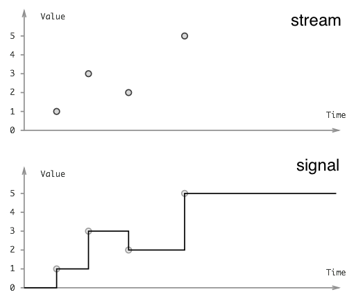

public:: true

- **Signals** represent continuous time varying quantities, like an electrical voltage, an audio signal or the current mouse coordinates.
- **Streams** (event streams) represent a sequence of discrete events, like key presses or network packets or financial transactions.
- 
- The key difference is in **backpressure** strategy:
	- Lazy sampling (signals)
		- signals are canonically **lazy**, they don’t compute or do work until **sampled**, and only the latest value is relevant (nobody cares where the mouse was a moment ago when nobody was looking).
		- Signals are a good fit for **rendering** because you only want to render at up to say 60fps (even if the mouse updates faster, which it does). and you only want to render what’s onscreen, and only when the tab is focused.
		- The `requestAnimationFrame` web browser API can and should be used to sample signals.
	- Slow down the producer (streams)
		- streams are **eager**, you can’t skip a keyboard event or a financial transaction, even if the pipes are backed up – instead you have to tell upstream to slow down so you can catch up.
		- The benefit of eagerness is the guarantee that you'll see every event, which means streams are suitable for driving **sequences of side effects** (keyboard event -> network request -> database transaction).
- **DOM rendering** is indeed effectful but not in the discrete way; the dom is a resource, it has a mount/unmount object lifecycle (see also [retained mode graphics APIs](https://en.wikipedia.org/wiki/Retained_mode)). Due to this symmetry, signals is a good fit for DOM rendering.
- Signals have an impedance mismatch with isolated discrete effects (without a corresponding undo operation), because backpressure will discard events and corrupt the system state.
- Can streams be used for rendering? Yes, but it's dis-optimal, and potentially by a lot. If your app chokes on a burst of events, you want to skip ahead and render the final state without bothering to render all the intermediate historical states. Signal laziness is what enables this "work skipping"; a stream would have to process each individual event in sequence.
-
- I have no idea if JS projects get the backpressure right (or even use the same definitions of signal), can anyone confirm?
-
- References
	- https://www.cs.yale.edu/homes/hudak/Papers/HSoM.pdf (2011)
	- http://conal.net/papers/push-pull-frp/push-pull-frp.pdf (2009) ("behaviors" are signals)
	- https://www.antonycourtney.com/pubs/genuinely-functional-guis.pdf (2001)
-
- Related CS topics:
	- functional reactive programming (and the "FRP Zoo")
	- functional effects
	- process supervision trees
	- observable sharing (DAGs)
	- garbage collection
	- concurrency
	- actors
	- workflows
-
- Dustin Getz is the founder of Hyperfiddle, a hyper-converged code playground for building cloud GUIs, and designed [Electric Clojure](https://github.com/hyperfiddle/electric), a fullstack signals DSL with fine-grained reactive network.