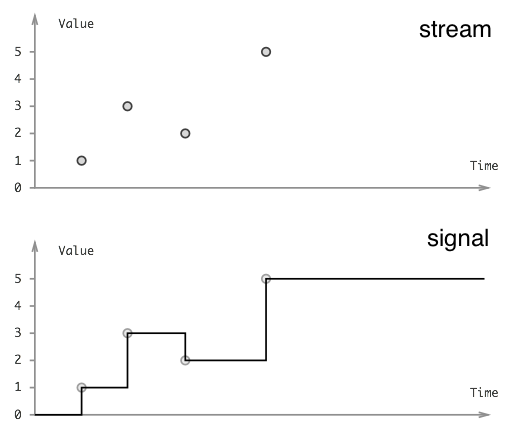

public:: true

- **Streams** (event streams) represent an **async sequence** of discrete events, like key presses or network packets or financial transactions.
- **Signals** represent continuous time varying quantities, like an electrical voltage, an audio signal or the current mouse coordinates.
- {:height 439, :width 513}
	- image credit: [Kefir JS, intro to Streams and Properties](https://kefirjs.github.io/kefir/#about-observables)
-
- Quick notes:
	- Both signals and streams are ways to do implement reactive computations
	- both use a "reactivity graph" which captures the flow of data as a DAG topology
	- both propagate async values through the DAG
	- {:height 170, :width 159}
	- **Observable sharing** = both signals and streams are **memoized**, which is what lets "diamond" topologies compute each upstream dependency once and only once.
-
- The key difference is in **backpressure** strategy:
	- **Lazy sampling (signals)**
		- signals are canonically **lazy**, they don’t compute or do work until **sampled**, and only the latest value is relevant (nobody cares where the mouse was a moment ago when nobody was looking).
		- Signals are a good fit for **rendering** because you only want to render at up to say 60fps (even if the mouse updates faster, which it does). and you only want to render what’s onscreen, and only when the tab is focused.
			- The `requestAnimationFrame` web browser API can and should be used to sample signals as it will only fire when the tab content is on screen.
	- **Slow down the producer (streams)**
		- streams are **eager**, you can’t skip a keyboard event or a financial transaction, even if the pipes are backed up – instead you have to tell upstream to slow down so you can catch up.
		- The benefit of eagerness is the guarantee that you'll see every event, which means streams are suitable for driving **sequences of side effects** (keyboard event -> network request -> database transaction).
-
- Notes
	- Signals can **skip duplicate values**. Streams cannot as they drive side effects.
	- `reduce` is used to convert a stream into a signal, by accumulating the events into a current value.
-
- Applications:
-
- **DOM rendering**
	- Both reactive HTML views and CSS animations match signals.
	- Critically, signals are lazy, so offscreen tabs will not be sampled and therefore that **unnecessary rendering work is automatically skipped**. (Why would you ever want to render a stale view? You wouldn't)
	- DOM resource management is indeed effectful but not in the discrete way. The DOM is a **resource**, it has a mount/unmount object lifecycle (see also [retained mode graphics APIs](https://en.wikipedia.org/wiki/Retained_mode)). Due to this symmetry, signals is a good fit for DOM rendering.
	- Signals have an impedance mismatch with isolated discrete effects (without a corresponding undo operation), because backpressure will discard events and corrupt the system state.
	- Can streams be used for rendering? Yes, but it's dis-optimal, and potentially by a lot. If your app chokes on a burst of events, you want to skip ahead and render the final state without bothering to render all the intermediate historical states. Signal laziness is what enables this "work skipping"; a stream would have to process each individual event in sequence.
	- I don't know if current JS frontend frameworks match this definition of signal, can anyone confirm?
-
- **Database incremental view maintenance**
	- This can be modeled as either signal or stream depending on the tradeoffs.
	- Signals will lazily compute a materialized view when sampled. Signals operate on values, not transaction-like deltas.
	- Streams will eagerly maintain the materialized view in response to each and every transaction. The cost is that all queries are always kept alive, and "booting" the system means replaying the event log since last snapshot. The benefit is minimization of latency.
-
- **Distributed stream processing**
	- event streams, because eagerness results in the **lowest latency for real-time applications**
	- Compare to batch database systems, where queries are request/response (which is a sampling operation).
	- Streams are async sequences, so it is easy to **fan out a streamy computation over a cluster** or distributed system.
-
- **Reactive client/server network sync in web apps**
	- This is original work from my colleagues and I at Hyperfiddle.
	- With [Electric Clojure](https://github.com/hyperfiddle/electric), we've demonstrated that fullstack web applications can be expressed as a single, unified signal graph that spans the client/server distributed system.
	- Key insights:
		- ["UIs are streaming DAGs"](https://hyperfiddle.notion.site/UIs-are-streaming-DAGs-e181461681a8452bb9c7a9f10f507991)
		- function -> async function -> stream function -> reactive function -> distributed function
		- reactive programming language (reactive-if, reactive lambda, reactive lexical scope)
	- The big idea is to **use a compiler to manage the frontend/backend boundary**:
		- Model the entire client/server system as signals
			- reactive frontend
			- reactive backend
		- **Connect frontend and backend together into one grand unified reactivity graph.**
		- The language itself is reactive, lexical scope is reactive.
		- When a backend signal updates, stream a message through a websocket and directly into the frontend lexical scope and continue propagating on the client.
		- Network is simply reactive signals broadcast through websocket.
		- the compiler automatically generates client and server from the unified program. The client and server stream lexical scope values back and forth over network.
		- There is a **network planner** to eliminate request waterfalls, which is possible because the DAG contains everything there is to know about how the data flows through the system.
		- Async, latency, failure and caching are all handled perfectly by the signal abstraction.
-
- I think this is enough for one day. More to come!
-
-
- References
	- https://www.cs.yale.edu/homes/hudak/Papers/HSoM.pdf (2011)
	- http://conal.net/papers/push-pull-frp/push-pull-frp.pdf (2009) ("behaviors" are signals)
	- https://www.antonycourtney.com/pubs/genuinely-functional-guis.pdf (2001)
-
- Related CS topics:
	- functional reactive programming (and the "FRP Zoo")
	- functional effects
	- process supervision trees
	- observable sharing (DAGs)
	- garbage collection
	- concurrency
	- actors
	- workflows
-
- Dustin Getz is the founder of Hyperfiddle, a hyper-converged code playground for building cloud GUIs, and designer of [Electric Clojure](https://github.com/hyperfiddle/electric), a fullstack signals DSL with fine-grained reactive network.