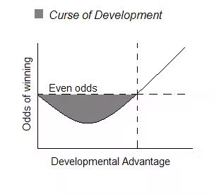

- "VENKATESH RAO: the depth of any transaction is limited by the depth of the shallower party. If the situational developmental gap between two people is sufficiently small, the more evolved person will systematically LOSE.
- "A trivial example: if you speak English and French, and your friend only speaks English, you will be forced to converse in English.
	- 
- "Three forces in play:
	- The less-developed person does not know what he/she does not know, and is typically attempting to operate from their regressed comfort zone of strength, which to you represents a zone of unrewarding mediocrity that you are attempting to leave, or have already left behind. This lends your opponent confidence.
	- Your own knowledge is fresh, unstable and not yet ingrained as second nature. You are acutely aware of, and anxious about, your beginner status in your new level. This makes you lack confidence.
	- To win through persuasion, you must teach the other party (a superior-inferior transaction), without first reversing the default unfavorable status relationship. (You: not confident, low-status, he/she: confident, high-status.)
- "Here is a trick to help you remember all this: it is always hard for a student to teach a teacher, even if the student is studying a subject that is more advanced than the one the teacher teaches. The content doesn’t matter. A rule of thumb in the teaching profession states that to be an effective teacher at a given level, you need to have studied five years beyond that level."
- — Source: Venkatesh Rao, [The Gervais Principle III: The Curse of Development](https://www.ribbonfarm.com/2010/04/14/the-gervais-principle-iii-the-curse-of-development/) (2010)